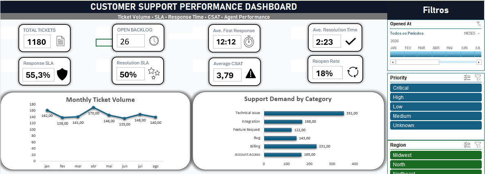

# Customer-Supporter-Dashboard

## Project Overview

This project is an interactive customer support performance dashboard developed in Microsoft Excel.

The goal was to transform a simulated raw support-ticket dataset into a clean, structured, and interactive analytical solution that allows users to monitor ticket volume, service-level performance, customer satisfaction, backlog, and agent workload.

The project covers the complete workflow from raw data preparation to dashboard development.

> This is a personal portfolio project developed using simulated business data. It does not represent a real company or client.

---

## Business Problem

A fictional SaaS company needed better visibility into the performance of its customer support operation.

Management wanted to answer questions such as:

- How many support tickets are received each month?
- Which categories generate the highest support demand?
- Are response and resolution SLA targets being met?
- Which priorities have the highest SLA failure rates?
- What is the current customer satisfaction level?
- Which agents handle the highest ticket volume?
- How large is the unresolved ticket backlog?
- How often are tickets reopened or escalated?

The objective was to build a dashboard that could answer these questions quickly and interactively.

---

## Tools Used

- Microsoft Excel
- Power Query
- PivotTables
- PivotCharts
- Excel formulas
- Slicers
- Timeline filters
- Data visualization

---

## Dataset

The dataset contains more than 1,000 simulated customer support tickets.

The main fields include:

- Ticket ID
- Opened Date
- Closed Date
- Status
- Priority
- Channel
- Region
- Customer Segment
- Product
- Issue Category
- Assigned Agent
- First Response Time
- CSAT Score
- Reopen Count
- Message Count
- Escalation Status

The raw dataset intentionally contained data-quality issues in order to simulate a realistic analytical workflow.

---

## Data Cleaning and Preparation

The raw dataset was cleaned and transformed using Power Query.

The preparation process included:

- Removing duplicate ticket records
- Standardizing inconsistent categorical values
- Cleaning unnecessary spaces and text inconsistencies
- Correcting mixed date and datetime formats
- Converting numeric values stored as text
- Handling missing values according to business context
- Preserving valid null values for unresolved tickets and unanswered CSAT surveys
- Creating calculated time and performance fields

The original raw data was preserved separately from the cleaned dataset.

---

## SLA Modeling

SLA targets were defined according to ticket priority.

| Priority | First Response SLA | Resolution SLA |
|---|---:|---:|
| Critical | 15 minutes | 4 hours |
| High | 30 minutes | 8 hours |
| Medium | 120 minutes | 24 hours |
| Low | 240 minutes | 48 hours |

These targets were merged into the cleaned dataset using Power Query.

Additional fields were created to identify whether each ticket:

- Met the First Response SLA
- Missed the First Response SLA
- Met the Resolution SLA
- Missed the Resolution SLA
- Was still pending resolution

---

## Calculated Fields

Additional analytical fields were created, including:

- Resolution Hours
- First Response SLA Status
- Resolution SLA Status
- Year
- Month
- Year-Month
- Month Start
- CSAT Group
- Reopened Flag
- Escalated Flag
- Backlog Flag

These fields support the KPIs, PivotTables, charts, and filters used in the final dashboard.

---

## Key Performance Indicators

The dashboard tracks several customer support KPIs:

- Total Tickets
- Open Backlog
- Average First Response Time
- Average Resolution Time
- First Response SLA Compliance
- Resolution SLA Compliance
- Average CSAT
- Reopen Rate

---

## Dashboard Preview

---

## Dashboard Features

The dashboard includes:

### Monthly Ticket Volume
Tracks how support demand changes over time.

### Support Demand by Category
Identifies which issue categories generate the highest number of support requests.

### SLA Performance by Priority
Compares SLA compliance across Critical, High, Medium, Low, and other ticket priorities.

### Agent Workload
Shows ticket distribution across customer support agents.

### CSAT by Customer Segment
Compares satisfaction levels across different customer groups.

### Ticket Status
Provides visibility into resolved, open, and pending cases.

---

## Interactive Filters

The dashboard includes interactive controls for:

- Date
- Priority
- Region
- Customer Segment
- Product
- Agent

The slicers and timeline are connected to the dashboard's PivotTables, allowing KPIs and charts to update dynamically according to the selected filters.

---

## Automation

The project was designed to support an automated refresh workflow:

Raw Data  
→ Power Query  
→ Clean Dataset  
→ PivotTables  
→ PivotCharts  
→ Dashboard

When the source data is updated, the analysis can be refreshed through Excel using **Refresh All**, automatically applying the Power Query transformations and updating the analytical components.

---

## Key Findings

Examples of insights identified through the dashboard include:

- [Add your first real finding here]
- [Add your second real finding here]
- [Add your third real finding here]
- [Add your fourth real finding here]

These findings should be based on the final cleaned dataset and dashboard rather than assumptions.

---

## Project Workflow

1. Business problem definition
2. Raw data assessment
3. Data cleaning with Power Query
4. Data transformation
5. SLA modeling
6. KPI development
7. PivotTable analysis
8. Interactive dashboard development
9. Business insight generation

---

## Files

`Customer_Support.xlsx`

Contains the complete Excel project, including the cleaned dataset, Power Query transformations, analytical structure, and interactive dashboard.

---

## Disclaimer

This project was created for educational and portfolio purposes using simulated business data.

The company, customers, support tickets, agents, and operational information represented in this project are fictional.
